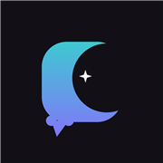
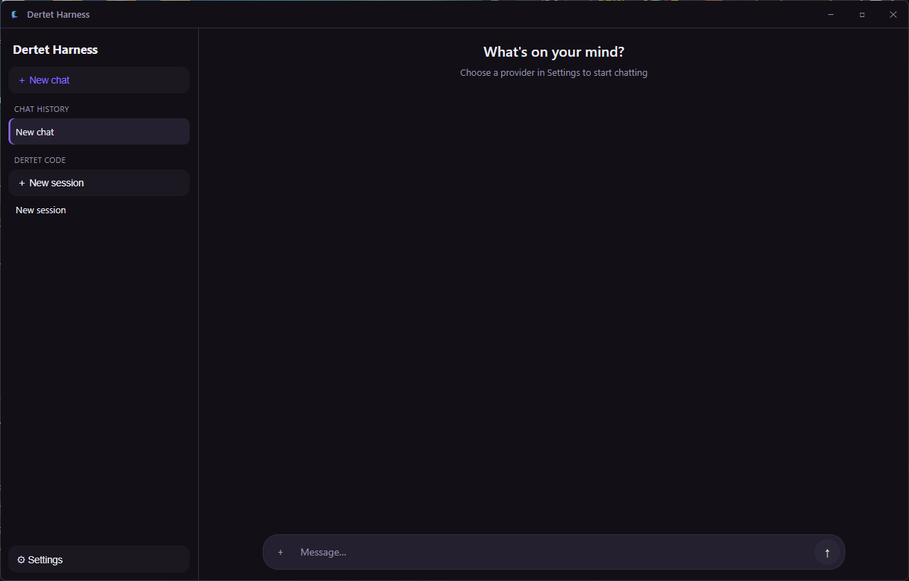

<p align="center">
  
</p>

<h1 align="center">Dertet Harness</h1>

<p align="center">
  One AI chat app for every provider, plus a real coding agent that actually does the work.<br>
  Windows · Android · iOS — your own API keys, your own models, your own data.
</p>

<p align="center">
  
</p>

---

## What this is

I got tired of juggling five different AI apps and browser tabs depending on which model I wanted to use that day — one for Claude, one for GPT, one for whatever's cheap on OpenRouter that week. So I built the thing I actually wanted: a single chat client that talks to basically any provider with your own API key, and on desktop, a proper coding agent (**Dertet Code**) that can read and edit files, run shell commands, browse the web, and — if you let it — control the mouse and keyboard, instead of just answering questions in a text box.

It's not a wrapper around one company's product. There's no vendor lock-in by design — you bring your own keys, you pick your own model per task, and nothing here phones home with your conversations.

## Platforms

- **Windows desktop** (Electron) — the full experience, home of Dertet Code.
- **Android** — native Kotlin + Jetpack Compose.
- **iOS** — native Swift + SwiftUI.

All three share the same dark, minimalist UI. No stock "glowing blue AI brain" clip art, no generic bot mascot — just a clean interface that gets out of the way.

## Providers

OpenRouter, Anthropic, OpenAI, Google Gemini, NVIDIA NIM, Groq, Together AI, Fireworks AI, Mistral AI, xAI, DeepSeek, Perplexity, Cohere, or any custom OpenAI-compatible endpoint. Model lists are fetched live from each provider, not hardcoded — so when a provider ships a new model, it shows up in the picker without an app update.

## Dertet Code — the part that isn't just a chatbot

This is the desktop-only agent harness, and it's the reason the project exists in the first place:

- **Real tools.** Reads files, writes them with clean diffs (not blind overwrites), runs shell commands with a timeout so nothing hangs forever, searches and fetches the web, and can take screenshots / move the mouse / type on your keyboard if you explicitly allow it.
- **Three permission modes.** Default (asks before anything risky), Plan (read-only, describes what it *would* do), Auto (does it, no prompts). You pick the leash length.
- **It learns from its own mistakes.** When something breaks or you push back on a bad answer, it does a short root-cause pass instead of just apologizing, and writes itself a note so it doesn't repeat the same mistake next session.
- **Shared memory across sessions.** Point two different chats at the same project folder and they both know what happened in the other one — it's not starting from zero every time you open a new tab.
- **It doesn't give up on a dropped connection.** Automatic retry with real backoff (1s, 3s, 5s, up to 50s) instead of just throwing an error the moment your wifi hiccups.
- **Slash commands** for when you don't want to reach for the mouse: `/compact`, `/status`, `/clear`, `/model`, `/help`.

## Other stuff worth mentioning

- Interactive choice menus — the model can hand you a clean numbered list (press 1–5, or type your own answer) instead of a wall of text when there's an actual decision to make.
- 9 languages with instant switching, no restart: Ukrainian, English, Russian, Portuguese, Polish, Kazakh, Romanian, German, French.
- Optional personalization memory — the app quietly picks up on what you work on over time (fully visible, fully editable, fully optional).
- Ships as a real installer on Windows, not a sketchy portable exe — pick your install folder, decide whether you want a desktop shortcut or a taskbar pin.

## Getting the app

- **Windows:** grab the installer from the [latest release](https://github.com/dertet-dev/dertet-harness/releases/latest) or build it yourself — see below.
- **Android:** build from source (no Play Store listing yet).
- **iOS:** source only for now — see [`dertet-harness-ios/README.md`](dertet-harness-ios/README.md) for the Xcode setup, since there's no signed build to distribute without an Apple developer account.

## Building from source

Each platform lives in its own folder with its own toolchain:

```
dertet-harness-desktop/   Electron + TypeScript + React — npm install && npm run dist
dertet-harness-android/   Android, Kotlin + Jetpack Compose — Gradle
dertet-harness-ios/       iOS, Swift + SwiftUI — see the README inside, needs Xcode on macOS
```

Desktop build produces both an NSIS installer and a plain unpacked folder under `release/`. Android needs your own signing keystore (see `keystore.properties.example` if you're setting one up — the real one is never committed). iOS has no `.xcodeproj` checked in on purpose; the README walks through creating one fresh in Xcode and dropping the source files in.

## Status

Actively developed, single-developer project. Things move fast and occasionally break — if you hit a bug, open an issue.
